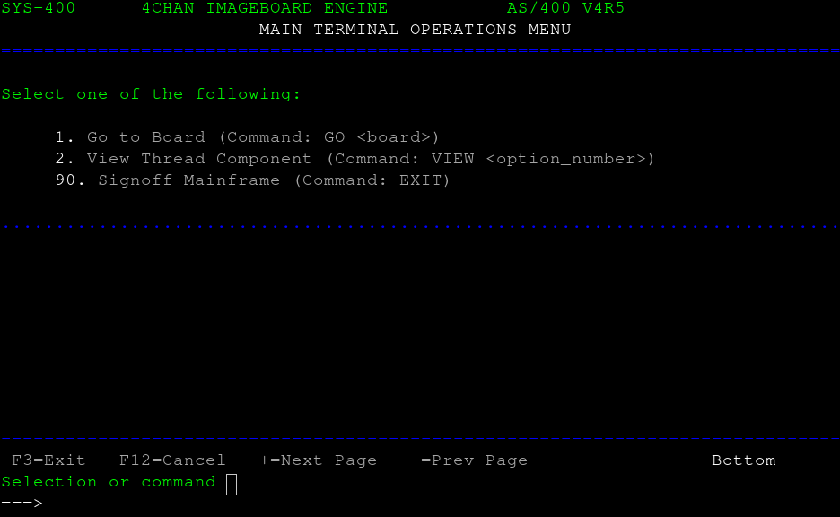
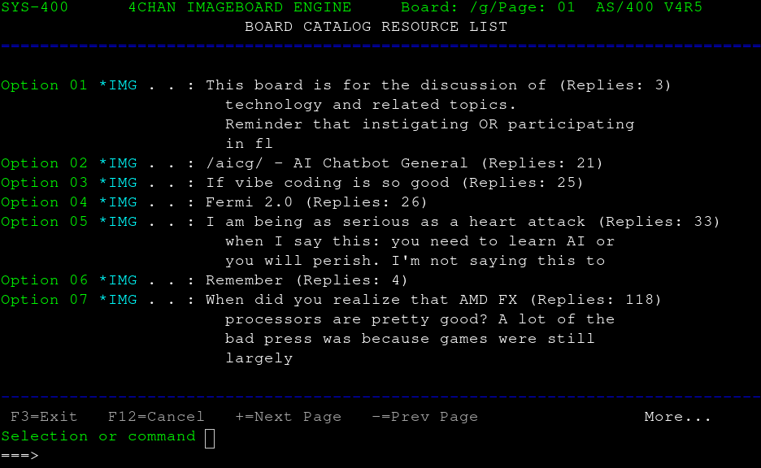
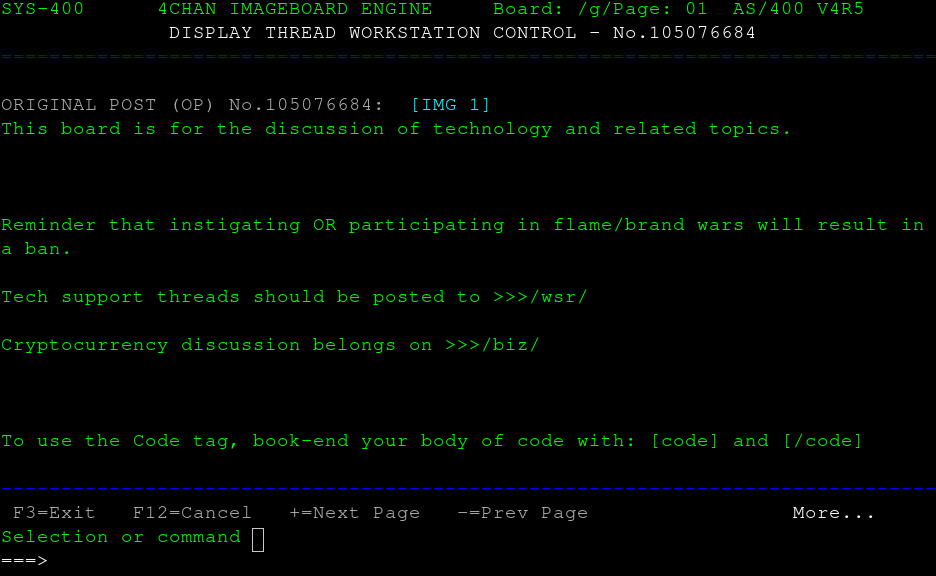
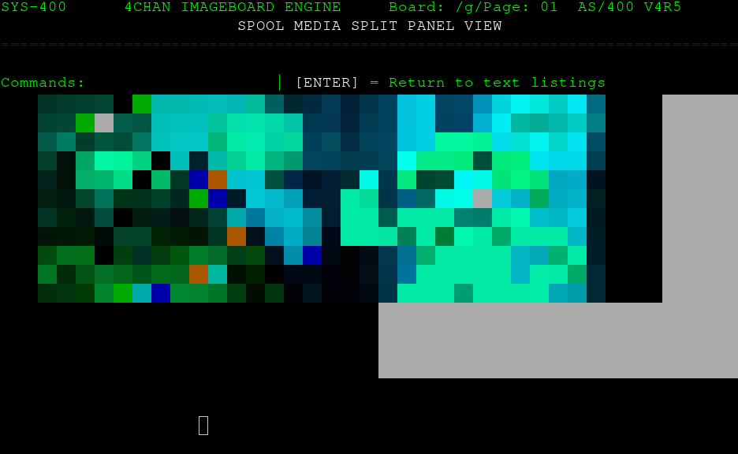
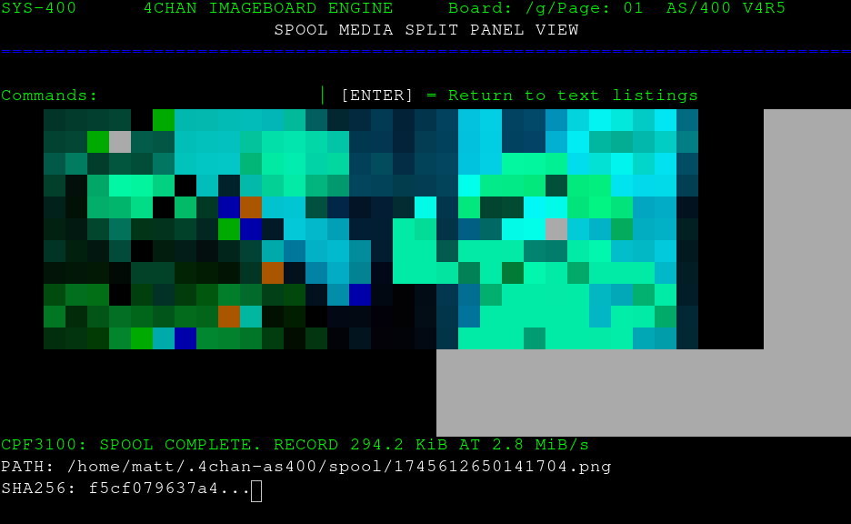

# 4CHAN AS/400 Terminal Engine

A retro, text-based terminal experience that bridges the modern web with legacy
enterprise workstations. This application is a **telnet-delivered 4chan
imageboard browser** rendered entirely in the look, feel, and navigational
conventions of an IBM AS/400 (System i) 5250 console: green-on-black headers,
`SYS-400` status bars, CPF-formatted messages, and a hard command line at row 23.

## Screenshots

### 1. Main Terminal Operations Menu

On connect, the system presents the classic AS/400 menu frame — header rule,
option list, function-key footer, and the blinking `===>` command cursor.



### 2. Board Catalog (`GO g`)

`GO <board>` pulls the live board catalog over HTTPS and renders it as a
numbered resource list — one record per thread, with subject, reply count, and
an `*IMG` marker whenever the post carries an attached file. The header bar
tracks the active board and page, and the footer flips to `More...` while
pagination is available.



### 3. Thread View (`VIEW 1`)

Selecting a record opens the thread in workstation-control style: the OP is
labeled `ORIGINAL POST (OP)` with its post number, and the body is wrapped to
the 78-column boundary. `IMG <n>` references in the post header name the
attached media by ordinal. Long threads page with `+` / `-`; paging past the
root of the thread walks you back to the catalog.



### 4. Media Split Pane (`IMG 1`)

The system's signature view. A full-resolution fetch of the post's image is
scaled to a fixed 30×15 aspect-ratio-locked thumbnail and drawn in **TrueColor
ANSI half-blocks** (`▀`) — the upper pixel of each cell as foreground, the
lower as background — so the picture reads inside a plain 7-bit telnet
session. Beside it, the engine renders an **ANSI QR code** (block-matrix
encoding) pointing at the raw external file URL, so a phone can scan the
terminal to open the original.

The pane hints are live: `DL` spools the asset to disk, and a bare `ENTER`
returns you to the previous text listing (catalog or thread) without
re-fetching it.



### 5. Spool Download Receipt (`DL`)

`DL` downloads the full-resolution asset to `~/.4chan-as400/spool/`
(permissions `0700`) under its original filename and prints a CPF-style
receipt: completion code, record size and transfer rate, local path, and a
SHA-256 prefix for integrity. Re-running `DL` on the same image overwrites the
same spool file in place — no `_01`/`_02` duplicates. The receipt holds on
screen for three seconds, then the pane returns to the command cursor.



## System Features

- **IBM 5250 Emulation UI** — AS/400 menu frames, `SYS-400` status headers
  with board/page indicators, function-key footers (`F3=Exit`, `+=Next Page`),
  dotted dividers, and CPF-formatted system messages (`CPF0801`, `CPF3100`…)
  for both success and error conditions.
- **Aspect-Ratio-Locked Terminal Imaging** — 4chan images are fetched at full
  resolution, downscaled with nearest-neighbor scaling, and rendered as dense
  TrueColor half-block (`▀`) graphics scaled to fit the 78×24 terminal
  boundary. No escape-protocol extensions required: plain SGR TrueColor.
- **Dual-Pane Media & QR Spooling** — inspecting an image places the rendered
  asset beside a live-generated ANSI QR code encoding the raw external file
  URL, so the picture and its canonical source sit on the same screen.
- **Server-Side SPOOL Downloads** — `DL` transfers the full asset to local
  disk with a printed receipt (size, rate, path, SHA-256), in overwrite-in-place
  semantics, all without a ZMODEM or any out-of-band channel.
- **Asynchronous Networking** — built on `telnetlib3` and `httpx`, the shell
  renders screens concurrently with network I/O for responsive refreshes, and
  each telnet session is fully isolated.

## Prerequisites

- Python 3.8+
- pip (Python package installer)

## Installation & Setup

Clone the repository:

```bash
git clone https://github.com/mml111/4chan-as400-engine.git
cd 4chan-as400-engine
```

(Optional but recommended) create a virtual environment:

```bash
python -m venv venv
# On Windows:
venv\Scripts\activate
# On macOS/Linux:
source venv/bin/activate
```

Install dependencies:

```bash
pip install -r requirements.txt
```

Run the server:

```bash
python 4chanas400.py
```

The console confirms the subsystem is operational and bound to a local TCP
telnet port (**default: 2324**).

## Usage & Navigation

Connect with any standard telnet client (PuTTY, `telnet`, or a terminal CLI):

```
telnet localhost 2324
```

All input is plain uppercase commands at the `===>` cursor.

| Command | Context | Action |
| --- | --- | --- |
| `GO <board>` (or bare `1`) | Main menu, or any listing | Navigate to an imageboard catalog (`GO g`, `GO sci`). From inside a catalog or thread, bare `1` also jumps to the default board's catalog. |
| `VIEW <n>` | Catalog | Open thread record `n` (OP + replies, paginated). |
| `IMG <n>` | Thread | Open the media split pane for image `n` on the current post (rendered thumbnail + QR). |
| `DL` | Media split pane | Spool the full-resolution asset to `~/.4chan-as400/spool/` and print the CPF3100 receipt. |
| `ENTER` (empty line) | Media split pane | Return to the previous text listing (thread or catalog). |
| `+` / `-` | Catalog / Thread | Page forward / backward. `-` at a thread's root returns to the catalog. |
| `EXIT` (or `90`) | Anywhere | Sign off the mainframe and close the session. |

## Project Structure

```
4chan-as400-engine/
├── 4chanas400.py         # Main execution script: telnet server, 5250 renderer,
│                         #   catalog/thread fetch, image + QR engine, spool pipeline
├── requirements.txt      # httpx, qrcode, Pillow, telnetlib3
├── docs/screenshots/     # Rendered screen captures (ANSI grid replay)
└── README.md             # Project documentation and usage guide
```

## License

Distributed under the MIT License. See `LICENSE` for more information.